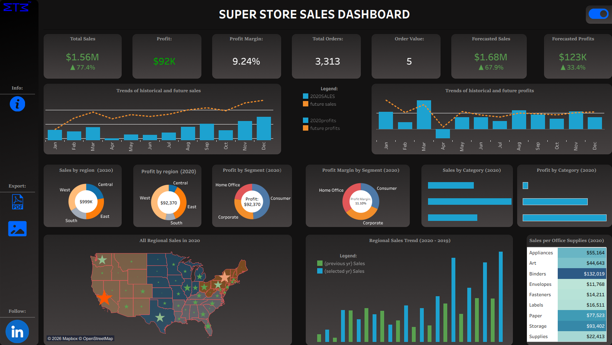

# Superstore Sales Executive Dashboard

## Overview

This project is an executive-level dashboard built on the Superstore dataset. The goal was to move beyond basic reporting and create a single view that answers three key questions:

* How is the business performing?
* What is driving that performance?
* What is likely to happen next?

The final dashboard combines historical analysis with forecasting to support both monitoring and forward planning.

---

## What I Built

I designed a consolidated dashboard that brings together:

* Core KPIs (sales, profit, margin, orders)
* Historical trends (monthly and yearly comparisons)
* Regional and segment performance
* Product and category insights
* Sales and profit forecasts

Instead of stacking multiple dashboards, I focused on summarizing the most important signals into one executive view.

---

## Key Features

**1. KPI Summary**
A top-level snapshot of overall performance, including growth indicators.

**2. Trend Analysis**
Monthly sales and profit trends with year-over-year comparisons to highlight seasonality and shifts in performance.

**3. Forecasting Layer**
Forecasted sales and profit using time series models. The goal here wasn’t perfect prediction, but to provide directional insight into future performance.

**4. Business Breakdown**
Focused views on:

* Region performance (to identify strong and weak markets)
* Segment profitability
* Category and product-level contribution

---

## Key Takeaways

A few insights that stood out while building this:

* The West region consistently outperforms others in both sales and profit
* Technology products drive the highest profit, even when not leading in volume
* Some states repeatedly generate losses, which affects overall margins
* Forecasts suggest continued growth in sales, but profit remains more volatile

---

## Challenges & How I Handled Them

**Combining Multiple Dashboards**
Initially, I had separate dashboards (sales, region, product, forecasting). Bringing them together made the layout cluttered.

→ I solved this by only keeping **one key visual per section** and focusing on clarity over completeness.

---

**Integrating Forecasting into the Dashboard**
The forecasting models (ARIMA/Prophet) were built outside the BI tool.

→ I exported the predictions and blended them with historical data so they could be visualized seamlessly.

---

**Limited Dataset**
The dataset is relatively simple and doesn’t include deeper business context (e.g., customer behavior, inventory).

→ I focused on extracting as much value as possible through calculated metrics like profit margin and order value.

---

## What I Learned

* Designing for executives is very different from building analytical dashboards
* Less is more — clarity matters more than the number of charts
* Forecasting adds value when it is clearly communicated, not when it is overly complex
* Structuring a dashboard is as important as the analysis itself

---

## Project Structure

```
/superstore-executive-dashboard
│
├── README.md
├── sales-dashboard.png
├── /data
├── /notebooks
└── /dashboard
```

---

## Preview



---

## Final Note

This project was a step toward combining business intelligence with predictive analysis in a single workflow. If I were to extend it further, I would look into adding more granular data (customer-level, inventory, etc.) and improving the forecasting with longer time series.

---
